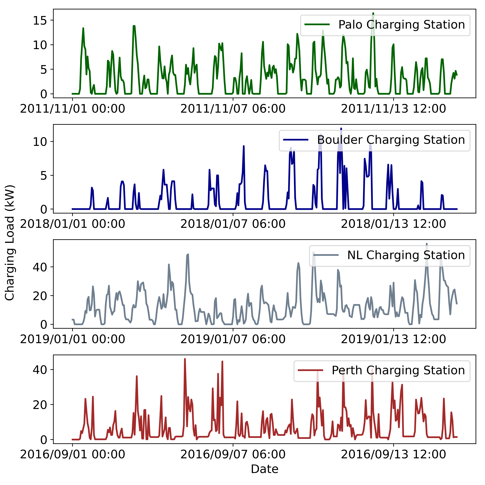

# MetaProbformer for Charging Load Probabilistic Forecasting of Electric Vehicle Charging Stations

This is the implementation of MetaProbformer, a charging load probabilistic forecasting method for electric vehicle charging stations, which is built based on [Informer](https://arxiv.org/abs/2012.07436).

## Requirements

- matplotlib==3.3.4
- numpy==1.19.5
- pandas==1.1.5
- properscoring==0.1
- scikit-learn==0.21.3
- scipy==1.5.4
- torch==1.9.1

## Data

we conduct experiments on four real-world charging load datasets: [PALO](https://data.cityofpaloalto.org/dataviews/241685/ELECT-VEHIC-CHARG-STATI-USAGE/), [Boulder](https://open-data.bouldercolorado.gov/datasets/), [NL](https://platform.elaad.io/analyses/ElaadNL\_opendata.php), and [Perth](https://data.pkc.gov.uk/dataset/ev-charging-data). Every dataset contains the start and end time as well as the total energy consumption kWh of each charging event. We transform each original dataset to a corresponding dataset that contains the average charging load kW in every hour. Each dataset includes charging load data for 4, 31, 12, and 24 months with 3113, 22632, 8760, and 17520 data points, respectively. The characteristics of four datasets are presented in the following table.

|  Dataset   | Number of Data Points  | Average Load (kW) | Peak Load (kW) | Non-zero Charging Hour Ratio (\%) |
|  ----  | ----  | ----  | ----  | ----  |
| Palo | 3113 | 2.01 | 16.43 | 52.39 |
| Boulder | 22632 | 6.78 | 53.12 | 64.74|
| NL | 8760 | 15.37 | 101.88 | 90.16 |
| Perth | 17520 | 13.95 | 124.91 | 95.36 |

The following figure shows the respective 15-day charging load curve sampled from each dataset.
